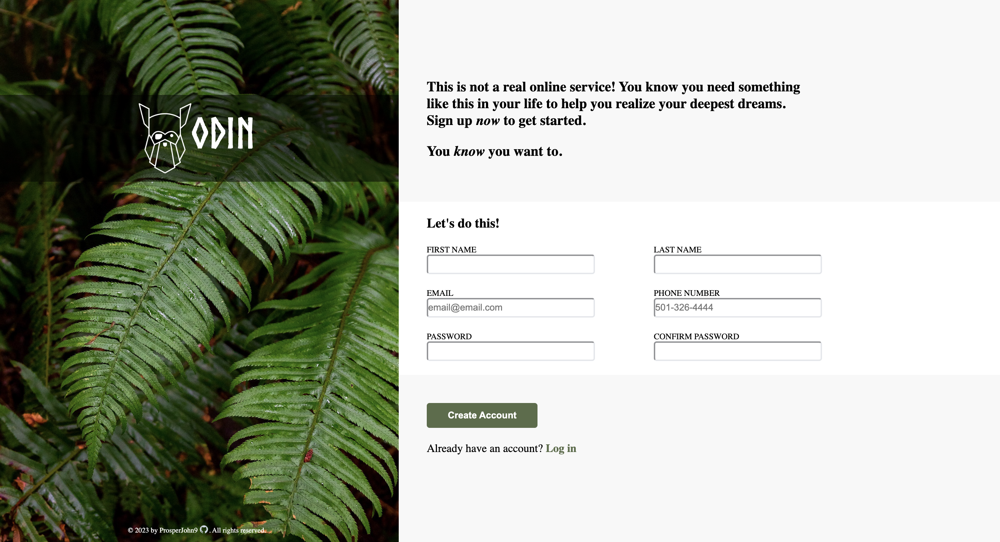

# Sign Up Form

Background image created by Halie West on unsplash.com

Cloning image sample using html,css and javascript

Live Demo:
https://prosperjohn9.github.io/form

Desktop View:

This project was created for the Sign-Up Form assignment as part of The Odin Project curriculum.
# Provided Assets
Project Design File: [sign-up-form.png](https://cdn.statically.io/gh/TheOdinProject/curriculum/5f37d43908ef92499e95a9b90fc3cc291a95014c/html_css/project-sign-up-form/sign-up-form.png)
Odin Logo: [odin-lined.png](https://cdn.statically.io/gh/TheOdinProject/curriculum/5f37d43908ef92499e95a9b90fc3cc291a95014c/html_css/project-sign-up-form/odin-lined.png)
Font: [Norse Bold]
Image Library: [halie-west-25xggax4bSA-unsplash.jpg](https://unsplash.com/photos/25xggax4bSA)
# Objectives
Build a page based on the Provided Assets